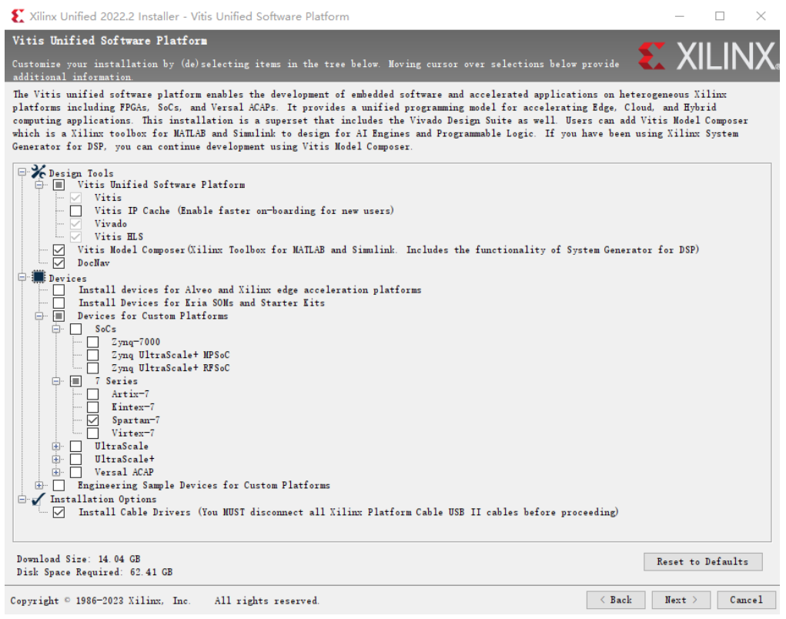
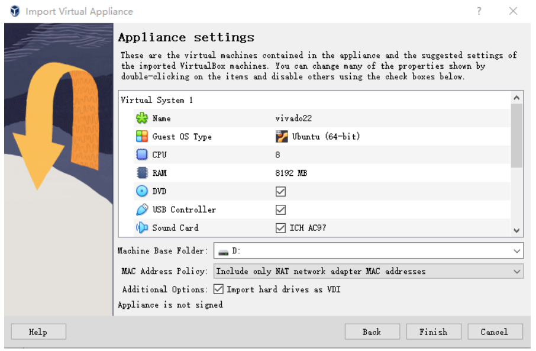
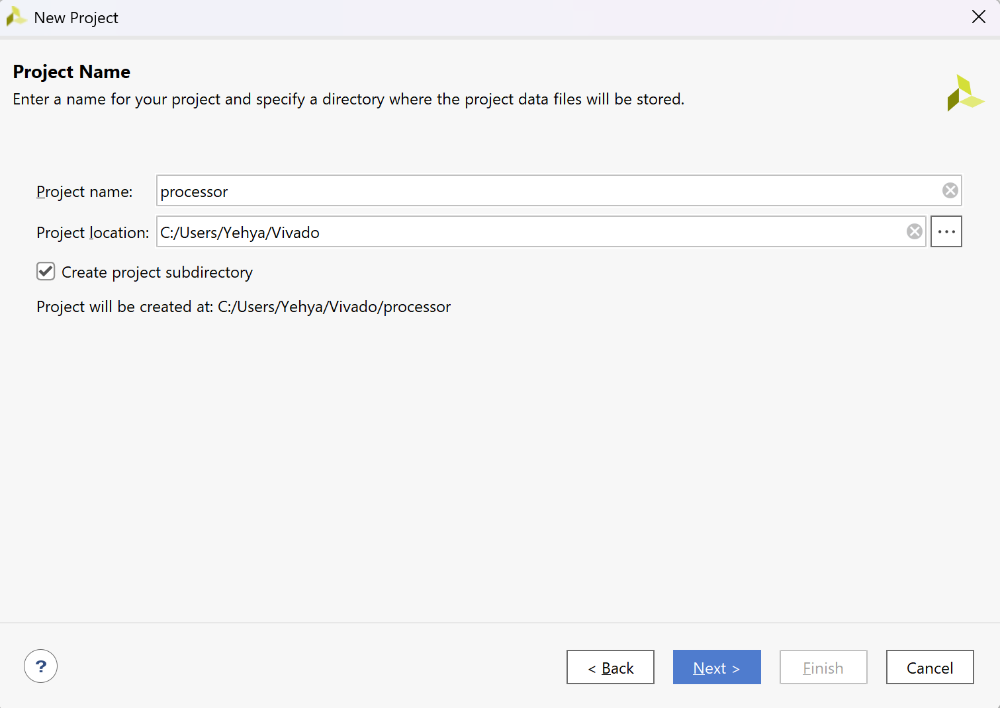
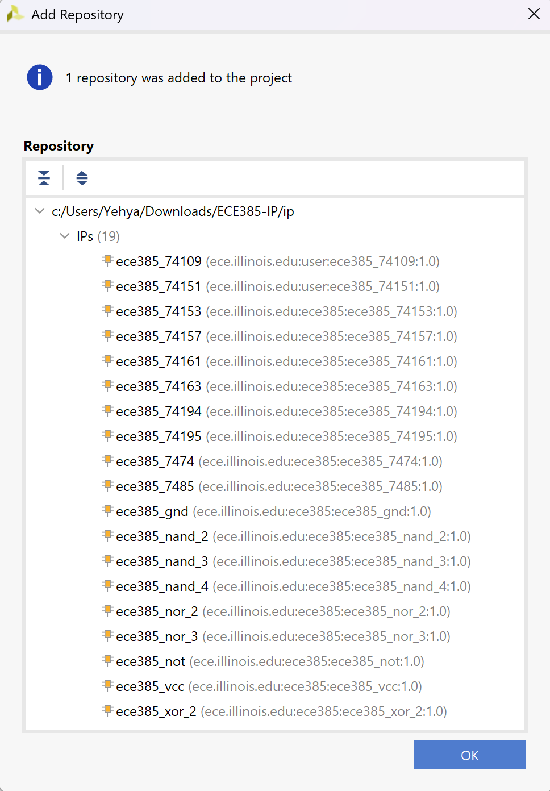
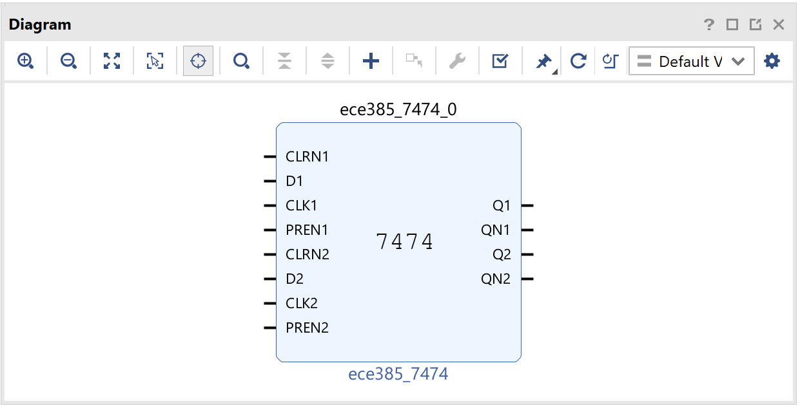
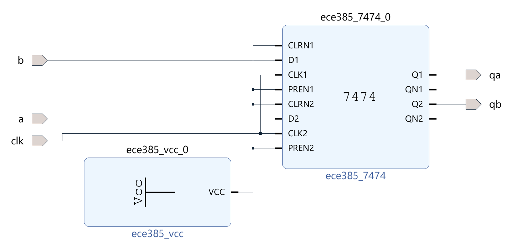

# ECE385-IP

This repository contains IP modules for use in ECE 385 Lab 2.1.
**Note: This is an experimental release intended primarily for schematic design. You are welcome to write testbenches and run simulations, but please be aware that the functionality of these IPs is not guaranteed to be fully correct.**

## Installing Xilinx Vivado

You need to be on a machine with Linux or Windows 10 or 11, either on your own machine or in
the ECE Open Lab (3022 ECEB). A Linux version is also available online for your own Linux
system. To perform this exercise on your own computer, you will need to install the Vivado
software (you may download the installer from the links below) or install it on a virtual machine.
Follow these steps to fully install the software:

### Option 1: Download and Install Directly from AMD Xilinx Website

- Install Vivado ML Edition 2022.2, Vitis Unified Software Platform, and Spartan-7 device
support from the AMD Xilinx website
(https://www.xilinx.com/support/download/index.html/content/xilinx/en/downloadNav/vivado-design-tools/2022-2.html). You should download the ***Xilinx Unified Installer
2022.2***.

- You will need to create a Xilinx account. Enter the information at Xilinx download
center, press download.

- Open the installer, press ***Next***. Fill in your User information for your Xilinx account,
choose ***Download and Install Now***, click ***Next***. Select ***Vitis*** as the product to install, click
***Next***. Mark related boxes for installation guided by Figure 1, click ***Next***. Select
installation destination, disk usage is around 63 GB. Click ***Next*** and start installation.

Once the installation has completed, you are now ready to begin using Vivado.

### Option 2: Use the provided Virtual Machine:

- Use the provided Virtual Machine that has Vivado ML Edition 2022.2, Vitis Unified
Software Platform, and Spartan-7 device support already installed. (You will need at least
130 GB Disk space for the VM). The virtual machine can be found on the course Canvas
page.

- Download and install Oracle VM VirtualBox version 7.0.8 from
https://www.virtualbox.org/wiki/Downloads following instructions. (Skip this step if you
already have VirtualBox or VMWare installed.)

- Make sure you install any specific host addons (e.g., for the USB drivers).

- Open Oracle VM VirtualBox, select ***Tools - Import***. Choose the downloaded .ova file,
select ***Next***.

- Select a folder for the ***Machine Base Folder***. You need to make sure the drive has more
than 130 GB. Note that the machine base folder may be on an external USB drive if your
main drive does not have sufficient free space. Select ***Finish*** and wait for the VM to be
imported. See Figure 2 for the default settings. Note that if you have fewer than 8 CPU
cores you will need to reduce the number of virtual cores. Similarly, if you only have
8GB of RAM total, you will need to reduce the total RAM to 7GB or lower. Computers with < 8GB of RAM will be unable to run VirtualBox with Vivado.

## Creating a Project

- Open ***Vivado 2022.2***.
- From ***Quick Start*** select ***Create Project***. Click ***Next*** to pass the intro screen.
- The window in Figure 3 will appear. Name the project ***processor*** and choose the project
location (make sure there are no spaces and no special characters in any of your entries).
In addition, make sure the path is as short as possible. Select ***Next***.
- Select ***RTL Project*** for the Project Type and do not mark the boxes yet. Click ***Next***.
- Do not add any sources yet, click ***Next***.
- Do not add any constraints yet, click Next.
- A window in Figure 4 will appear, search, and select ***XC7S50CSGA324-1***, click ***Next***.
- Click ***Finish***.
- You should now see the ***Project Manager*** window.

**An Important Note on Project Location:**
If you are using any of the EWS labs
(including 3022 ECEB), do not work
directly from the U:\ (EWS Home) drive.
Not only will the performance be very poor
when other students are in the labs - some
later labs, especially those requiring Vitis
SDK, will not build correctly as some of
the underlying tools do not recognize
network paths. Instead put your project in a
simple directory in the C:\Users\<netid>
folder, for example:
C:\Users\ljames23\ece385\lab2\
Note that this path has no spaces and is
relatively short. In addition, other students
will not have permission to access your
“Users” folder, so you will not have to
worry about students plagiarizing your
code. Keep in mind that you will have to
copy the project back into your U:\ drive to
switch computers, as the “Users” folder is
not synchronized across computers.
An alternative is to work from a USB 3
flash drive or portable SSD. Just be sure to
back up your data often as USB drives
often fail.

## Creating the Schematic

- This section provides a tutorial on using the IPs to build your schematic.
- We have provided you with a repository of IPs (Intellectual Properties), that contains all the components you will need for building any circuit in ECE 385.
- At the top right, hit `Tools` -> `Settings...`
- Hit the arrow to the left of `IP`. That should reveal two new options: `Repository` and `Packager`. Hit `Repository`
- Hit the `+` button and look for the `ip` directory (remember to clone this repository on your machine).
- If you were able to successfully add the IP repository, you will be presented with a window similar to the one in the image below:

- Now hit `OK` -> `Apply` -> `OK`
- On the left hand side, under `IP INTEGRATOR`, click on `Create Block Design`, set the `Design name` to `processor` then hit `OK`. **IMPORTANT NOTE:** The directory of the project should be `<Local to Project>`. Do not modify this!
- We can add blocks by pressing the `+` button on the `Diagram` toolbar (or hit `Ctrl+I`) and type `ece385` in the search bar
- You should be presented with a list of components corresponding to the above image. Each IP's name starts with `ece385_` followed either by the type of gate and its number of inputs or the part number. For example, `ece385_xor_2` simulates a 2-input `XOR` gate, and `ece385_7474` simulates the SN**74**HC**74**N IC chip found in your lab kit!
- Go ahead and add a 7474 chip by simply clicking on `ece385_7474`

- Hint: At this point, you will probably want to make your working area larger. Hit the Maximize or the Float button at the top right of the Diagram window
- Now add `Vcc`. Connect the I/O of the blocks by dragging the black end of one to another.
- Create ports a.k.a top-level I/O (Input/Output) by right-clicking on an empty space in the diagram and select `Create Port...`
- Hint: `Ctrl+K` also works for the previous step.
- We are going to create two input ports and one output port. Change the Port Name and Direction options to match the following table:

| Port Name | Direction |
|-----------|-----------|
| a         | input     |
| b         | input     |
| clk       | input     |
| qa        | output    |
| qb        | output    |

- Arrange the port as follows:  

- This concludes the tutorial. You may remove all that you added and begin designing your block diagram for lab 2.1!